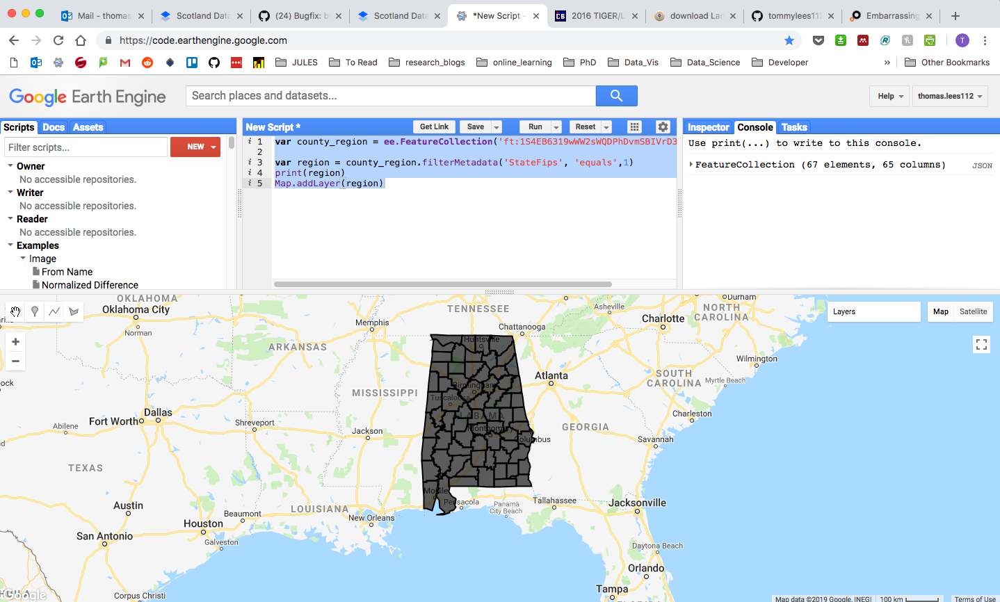

# Crop yield Prediction with Deep Learning
The necessary code for the paper, [Deep Gaussian Process for Crop Yield Prediction Based on Remote Sensing Data](http://jiaxuanyou.me/files/Jiaxuan_AAAI17.pdf), AAAI 2017 (Best Student Paper Award in Computational Sustainability Track). We are glad to win the "Best Big Data Solution" in [World Bank Big Data Innovation Chanllenge](http://bigdatainnovationchallenge.org/) as well.

***

TODO:
----
* Figure out how to get the data onto the server
.* ALOT of data so need google drive
.* download to goole drive
.* sync google drive to local machine
.* NOTE: needs BIG google drive and BIG local machine

*

***
Here is a brief introduction on the utilities for each folder.

## **"/1 download data"**
> How we download data from Google Earth Engine to Google Drive. Users then need to export data from Google Drive to their local folder, e.g., their clusters. The trick there is that we first concatenated all images across all the years available (say 2003 to 2015), then download the huge image at once, which could be hundreds of times faster.

**pull_MODIS.py**
* collect modis data and group multiple bands into one imag
* Product: ` MODIS/MOD09A1`
* filter by the locations in the `locations_final.csv` file
* Date: NO DATE FILTER
* Range: ` `
* Region:

```python
offset = 0.11
region = str([
    [lat - offset, lon + offset],
    [lat + offset, lon + offset],
    [lat + offset, lon - offset],
    [lat - offset, lon - offset]])
```
**pull_MODIS_entire_county.py**
* get State > County data (loc1 = state, loc2=county in locations_final.csv)
* Product: ` MODIS/MOD09A1`
* from the `locations_remedy.csv` (doesn't exist!)
* Date: `filterDate('2001-12-31','2015-12-31')`
* Range: `None`
* Region:

```python
county_region = ee.FeatureCollection('ft:1S4EB6319wWW2sWQDPhDvmSBIVrD3iEmCLYB7nMM')

# filter for a county
region = county_region.filterMetadata('STATE num', 'equals', loc1)
region = ee.FeatureCollection(region).filterMetadata('COUNTY num', 'equals', loc2)
region = region.first()
region = region.geometry().coordinates().getInfo()[0]
```

**pull_MODIS_entire_county_clip.py**
* Product: `MODIS/MOD09A1`
* from the `locations_final.csv`
* Date: `.filterDate('2002-12-31','2016-8-4')`
* Range: ` img_5000: img_0`
* Region:

```python
county_region = ee.FeatureCollection('ft:1S4EB6319wWW2sWQDPhDvmSBIVrD3iEmCLYB7nMM')
region = county_region.filterMetadata('StateFips', 'equals', int(loc1))
region = ee.FeatureCollection(region).filterMetadata('CntyFips', 'equals', int(loc2))
region = ee.Feature(region.first())
```

**pull_MODIS_landcover.py**
* Product: `MODIS/051/MCD12Q1 `
* from the `'locations.csv'`
* Date: `None`
* Range: `None`
* Region:

```python
offset = 0.11
region = str([
    [lat - offset, lon + offset],
    [lat + offset, lon + offset],
    [lat + offset, lon - offset],
    [lat - offset, lon - offset]])
```

**pull_MODIS_landcover_entire_county.py**
* Product: ` MODIS/051/MCD12Q1`
* from the `'locations_major.csv'`
* Date: `filterDate('2001-12-31','2015-12-31')`
* Range: ` None`
* Region:

```python
county_region = ee.FeatureCollection('ft:18Ayj5e7JxxtTPm1BdMnnzWbZMrxMB49eqGDTsaSp')
# filter for a county
region = county_region.filterMetadata('STATE num', 'equals', loc1)
region = ee.FeatureCollection(region).filterMetadata('COUNTY num', 'equals', loc2)
region = region.first()
region = region.geometry().coordinates().getInfo()[0]
```

**pull_MODIS_landcover_entire_county_clip.py**
* Product: ` MODIS/051/MCD12Q1`
* from the `locations_remedy.csv`
* Date: `filterDate('2001-12-31','2015-12-31')`
* Range: ` None`
* Region:

```python
region = county_region.filterMetadata('STATE num', 'equals', loc1)
region = ee.FeatureCollection(region).filterMetadata('COUNTY num', 'equals', loc2)
region = region.first()
region = region.geometry().coordinates().getInfo()[0]
```

**pull_MODIS_temperature_entire_county.py**
* Product: `MODIS/MYD11A2 `
* from the `locations_major.csv`
* Date: `.filterDate('2002-12-31','2015-12-31')`
* Range: ` None`
* Region:

```python
county_region = ee.FeatureCollection('ft:18Ayj5e7JxxtTPm1BdMnnzWbZMrxMB49eqGDTsaSp')
region = county_region.filterMetadata('STATE num', 'equals', loc1)
region = ee.FeatureCollection(region).filterMetadata('COUNTY num', 'equals', loc2)
region = region.first()
region = region.geometry().coordinates().getInfo()[0]
```

**pull_MODIS_temperature_entire_county_clip.py**
* Product: ` MODIS/MYD11A2`
* from the `locations_final.csv`
* Date: `filterDate('2002-12-31','2016-8-4')`
* Range: ` None`
* Region:

```python
county_region = ee.FeatureCollection('ft:1S4EB6319wWW2sWQDPhDvmSBIVrD3iEmCLYB7nMM')
# filter for a county
region = county_region.filterMetadata('StateFips', 'equals', int(loc1))
region = ee.FeatureCollection(region).filterMetadata('CntyFips', 'equals', int(loc2))
region = ee.Feature(region.first())
```

**pull_MODIS_world.py**
* Product: `MODIS/MOD09A1 `
* from the `'world_locations.csv'`
* Date: `filterDate('2001-12-31','2015-12-31')`
* Range: ` img_0: img_5000`
* Region:

```python
world_region = ee.FeatureCollection('ft:1tdSwUL7MVpOauSgRzqVTOwdfy17KDbw-1d9omPw')

# filter for a country
region = world_region.filterMetadata('Country', 'equals', country)
if region==None:
    print(country,index,'not found')
    continue
region = region.first()
region = region.geometry().coordinates().getInfo()[0]
```

**pull_MODIS_world_hist.py**
* Product: `MODIS/MOD09A1`
* from the `'world_locations.csv'`
* Date: `filterDate('2001-12-31','2015-12-31')`
* Range: ` `
* Region:

```python
world_region = ee.FeatureCollection('ft:1tdSwUL7MVpOauSgRzqVTOwdfy17KDbw-1d9omPw')
# filter for a country
region = world_region.filterMetadata('Country', 'equals', country)
if region==None:
    print(country,index,'not found')
    continue
region = region.first()
```

NOTE:

```
################
# Data range
# MODIS: 2003-2016, 14 years
# MODIS_landcover: 2003-2013, 12 years
# MODIS_temperature: 2003_2015, 13 years

# Intersection: 2003-2013, 11 years

################
```

***

##**"/2 clean data"**
>How the raw data is preprocessed, including slicing the huge images to get individual images, 3-D histogram calculations, etc.

**final_clean_data.py**
* Get the yield data from `yield_final.csv`
* for all .tif files (drawn from Earth Engine above)
.*   transpose the images
.*   shift temperature, scale temperature, clean temperature (-ves/5000)
.*   create crop mask
..*   Note mask = landcover mask (==12 is crop mask)
.*   create yearly images
.*   merge yearly modis with temperature
.*   mask the images

Transpose:
`np.transpose(np.array(gdal.Open({MODIS, MODIS_temperature, MODIS_mask}_path).ReadAsArray(), dtype='uint16'),axes=(1,2,0))`

**final_save_histogram.py**
* Class fetch_data()
.* train test split
.*
.*
.*
.*
.*

***
##**"/3 model"**
>The CNN/LSTM model structure, written in tensorflow (v0.9). The Gaussian Process model, written in python.

**GP_crop_v3.py**
* Gaussian Process = Rasmussen and Williams p28
*
**nnet_for_hist_dropout_stride.py**
*
*
**nnet_lstm.py**
*
*
**train_for_hist_alldata.py**
*
*
**train_for_hist_alldata_lstm.py**
*
*

***

##**"/4 model_batch"**
>Since we are training different models for each year and each month, a batch code is used for training.

**nnet_for_hist_dropout_stride.py**
*
*
**nnet_lstm.py**
*
*
**train_for_hist_alldata_loop.py**
*
*
**train_for_hist_alldata_loop_corn.py**
*
*
**train_for_hist_alldata_loop_lstm.py**
*
*
**train_for_hist_alldata_loop_permute.py**
*
*
**train_for_hist_alldata_loop_result.py**
*
*

***

##**"/5 model_semi_supervised"**
>A recent contribution, extending the model with semi-supervised deep generative model, however it doesn't work well.  We are happy to discuss the model if you can make it work.

**nnet_semi.py**
*
*
**nnet_semi_old.py**
*
*
**train_for_semi.py**
*
*
**train_for_semi_labeled_data.py**
*
*

***

##**"/6 result_analysis"**
>Plot results, plot yield map, etc.

**GP_crop_v3.py**
*
*
**GP_crop_v3_loop.py**
*
*
**NDVI.py**
*
*
**colorbar.py**
*
*
**corr.py**
*
*
**monthly_read.py**
*
*
**permute.py**
*
**variogram.py**
*
*
**yield_map.py**
*
*
**yield_map_function.py**
*
*

***

## **data**
`input`
* locations_final.csv

| loc1(STATE) | loc2(COUNTY) | lat | lon|
| --- | --- | --- | --- |

* yield_final.csv

* yield_final_highquality.csv

| year | loc1(STATE) | loc2(COUNTY) | yield |
| --- | --- | --- | --- |

`outputted`
* CNN_err.svg
* Compare_result.npz
* Compare_result_final.npz
* Compare_result_ridge.npz
* GP_err.svg
* corr.npy
* counties.svg
* paper_result.npy
* permute_band.npy
* permute_time.npy
* variogram_data.mat

For more information, please contact Jiaxuan You.

youjiaxuan@gmail.com.

***

# Our edits & changes

We want to run from python3 so we will be using the requirements_3.txt

Should have used the python2 implementation as want to reproduce the results. ARGHHH

### Do we have to specify our own EE login details?

YES! We want to use the Earth Engine Command Line Interface.

`earthengine authenticate`
Which will open a browser popup. You should login to your account and then copy the code into the command line interface.

This will add a refresh token to your `~/.config/earthengine/credentials` file.

### Do we need lots of space on our own Google drive?
### How do we pull from the EE - Google Drive - Local machines?

***

# QUESTIONS:

## Earth Engine API
HELP: https://geoscripting-wur.github.io/Earth_Engine/

* Raster data are represented as Image objects
* Datasets are represented as Image Collections

> An image collection refers to a set of Earth Engine images... this collection represents every Landsat 8 scene collected, all over the Earth

* Find the ID of the collections [here](https://developers.google.com/earth-engine/datasets/)
* collection represents every Landsat 8 scene collected, all over the Earth
* limit the collection by time `filterDate` or space `filterBounds`

### all MODIS images within a bounding box
```python
imgcoll = ee.ImageCollection('MODIS/MOD09A1') \
    .filterBounds(ee.Geometry.Rectangle(-106.5, 50,-64, 23))
```

### Combine 1-band perimage into data-cube (2D image + D of bands)!

Turn multiple bands into ONE image with multiple bands ( a cube! )
```python
    # write a function for collecting all the data into one image
    def appendBand(current, previous):
        """
        Transforms an Image Collection with 1 band per Image into a single Image
         with items as bands.
        Author: Jamie Vleeshouwer
        """
        # Rename the band
        previous=ee.Image(previous)
        current = current.select([0,1,2,3,4,5,6])

        # Append it to the result (Note: only return current item on first element/iteration)
        accum = ee.Algorithms.If(ee.Algorithms.IsEqual(previous,None), current, previous.addBands(ee.Image(current)))

        # Return the accumulation
        return accum

    # apply this function to all of the collection to create one object
    img = imgcoll.iterate(appendBand)
```

### Export data-cube to Google Drive!
```python
    def export_oneimage(img,folder,name,region,scale,crs):
      """ Create an earth engine task to export the image to google drive """
      task = ee.batch.Export.image(img, name, {
          'driveFolder':folder,
          'driveFileNamePrefix':name,
          'region': region,
          'scale':scale,
          'crs':crs
      })
      task.start()

      while task.status()['state'] == 'RUNNING':
        print('Running...')
        # Perhaps task.cancel() at some point.
        time.sleep(10)

      print('Done.', task.status())
```

* Make a folder called `Data` in your base google drive directory
* then you can export that folder directly (download)

**NOTE:** to download use this [Firefox plugin](https://addons.mozilla.org/en-US/firefox/addon/cliget/).
* it will generate a wget command for downloading files from behind a login.

### How do I pull from google drive onto the cluster / remote machine?

Currently following this process:
1) login to google drive on Firefox
2) use the [cliget extension](https://github.com/zaidka/cliget)
3) copy the wget command into terminal on Remote machine and download zip file

Needs to be automated as too slow:
* learn how to push to google cloud
* connect google cloud bucket to download automatically to server?

### How do I know which state is which?
```javascript
var county_region = ee.FeatureCollection('ft:1S4EB6319wWW2sWQDPhDvmSBIVrD3iEmCLYB7nMM')
var state_num = 1

var region = county_region.filterMetadata('StateFips', 'equals', state_num)
print(region)
Map.addLayer(region)
```

### What state is subset_locations.csv?

Alabama!




